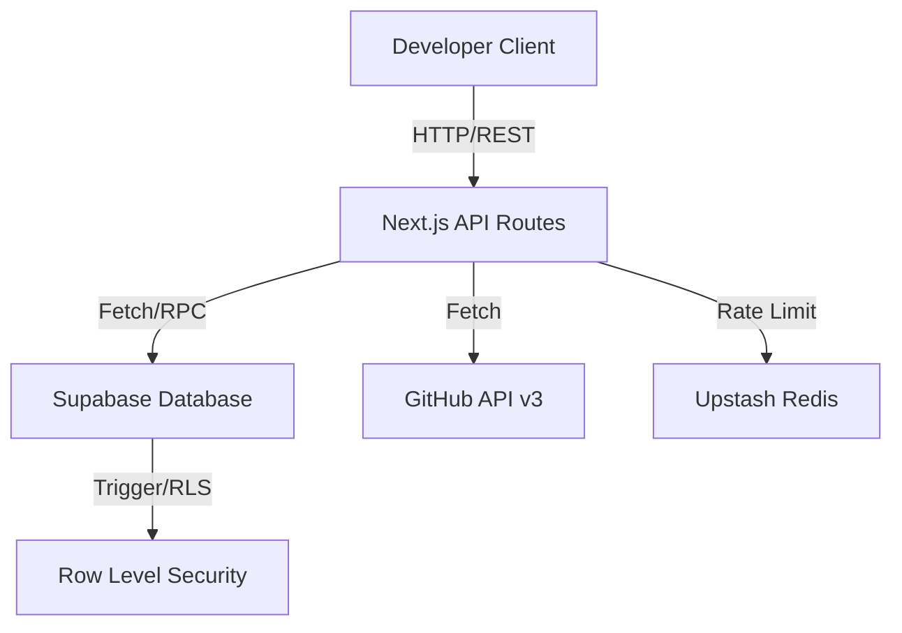

# API & Reference Architecture

This document details the architecture and API surfaces of the OSSfolio platform.

## Architecture Diagram



## API Versioning

| Prefix | Type | Auth | Stability |
|--------|------|------|-----------|
| `/api/v1/` | Public REST | Optional | Stable |
| `/api/` | Internal | Varies | Unstable |
| `/api/webhooks/` | Webhook | Signature | Stable |

## Response Envelope

All endpoints return a standard JSON envelope:

```json
{
  "data": { ... },
  "error": "optional error message",
  "meta": {
    "requestId": "uuid"
  }
}
```

## API Specifications

All endpoints are hosted under `/api/` and return JSON payloads.

### Public Profile API

`GET /api/v1/users/[username]`

- **Authentication**: None (Public)
- **Rate Limit**: 60 req/min per IP
- **Response Shape**:
```json
{
  "username": "string",
  "name": "string",
  "avatar_url": "string",
  "github_url": "string",
  "bio": "string",
  "score": 120,
  "stats": {
    "commits": 45,
    "prs": 12,
    "issues": 3,
    "reviews": 8
  },
  "top_languages": ["TypeScript", "Rust"],
  "badges": [],
  "followers": 150
}
```

### Discover API

`GET /api/discover?page=1&search=&sort=score&type=users`

- **Authentication**: None (Public)
- **Query Params**: `page` (number), `search` (string), `sort` (score|name), `type` (users|organizations)
- **Response Shape**:
```json
{
  "rows": [ { "username": "...", "score": 120, "avatar_url": "..." } ],
  "hasNext": true
}
```

### Profile Refresh

`POST /api/[username]/refresh`

- **Authentication**: Required (own profile)
- **Rate Limit**: 1 req per 5 min per IP (Upstash Redis)
- **Response**: `{ "success": true, "profile": { ... } }`
- **429 Response**: `{ "error": "Too many refresh requests. Try again later." }`

### Contribution Data

`GET /api/[username]/contributions?year=2026`

- **Authentication**: None (Public)
- **Query Params**: `year` (number, optional, defaults to current)
- **Response**: GitHub-style contribution calendar array

### Settings API

`GET /api/settings`
`PUT /api/settings`

- **Authentication**: Bearer token required
- **Request Body (PUT)**: `{ "bio": "...", "headline": "...", "visibility": "public" }`
- **Response Shape**:
```json
{
  "settings": {
    "bio": "string",
    "headline": "string",
    "visibility": "public|unlisted",
    "custom_links": []
  }
}
```

### Profile Sync (Admin)

`POST /api/profile/sync`

- **Authentication**: Service role key required
- **Purpose**: Trigger score recalculation for a user
- **Response**: `{ "success": true }`

### GitHub Webhook

`POST /api/webhooks/github`

- **Authentication**: GitHub webhook signature
- **Purpose**: Trigger profile refresh on push events
- **Response**: `{ "status": "accepted" }`

## Error Responses

| Status | Meaning | Example |
|--------|---------|--------|
| 400 | Bad request | `{ "error": "Missing required field" }` |
| 401 | Unauthorized | `{ "error": "Authentication required" }` |
| 404 | Not found | `{ "error": "User not found" }` |
| 429 | Rate limited | `{ "error": "Too many requests" }` (with `Retry-After` header) |
| 500 | Server error | `{ "error": "Internal server error" }` |
| 502 | Upstream failure | `{ "error": "GitHub API unreachable" }` |
| 503 | Service unavailable | `{ "error": "Service temporarily unavailable" }` |

## Security Headers

All API responses include:
- `X-Content-Type-Options: nosniff`
- `X-Frame-Options: DENY`
- `Referrer-Policy: strict-origin-when-cross-origin`
- CORS headers on public endpoints
