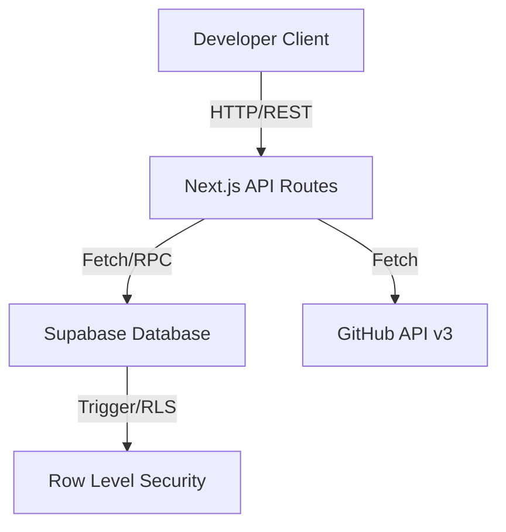

# API & Reference Architecture

This document details the architecture and api surfaces of the OSSfolio platform.

## Architecture Diagram



## API Specifications

All endpoints are hosted under `/api/` and return JSON payloads.

### Public Profile API

`GET /api/v1/users/[username]`

- **Authentication**: None (Public)
- **Response Shape**:
```json
{
  "username": "string",
  "name": "string",
  "avatar_url": "string",
  "score": 120,
  "stats": {
    "commits": 45,
    "prs": 12,
    "issues": 3
  }
}
```

### Settings API

`GET /api/settings`  
`PUT /api/settings`

- **Authentication**: Bearer token required
