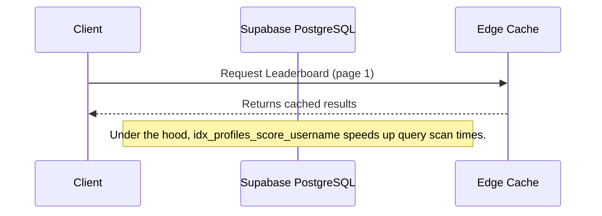
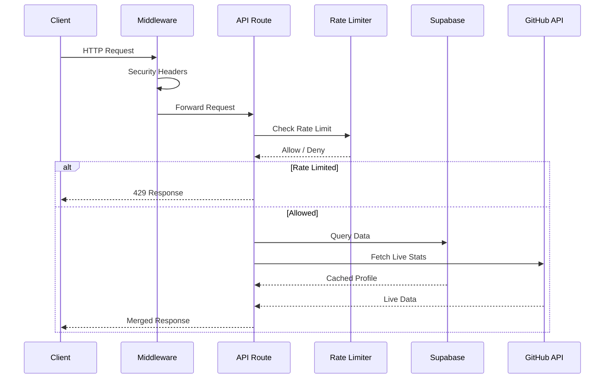
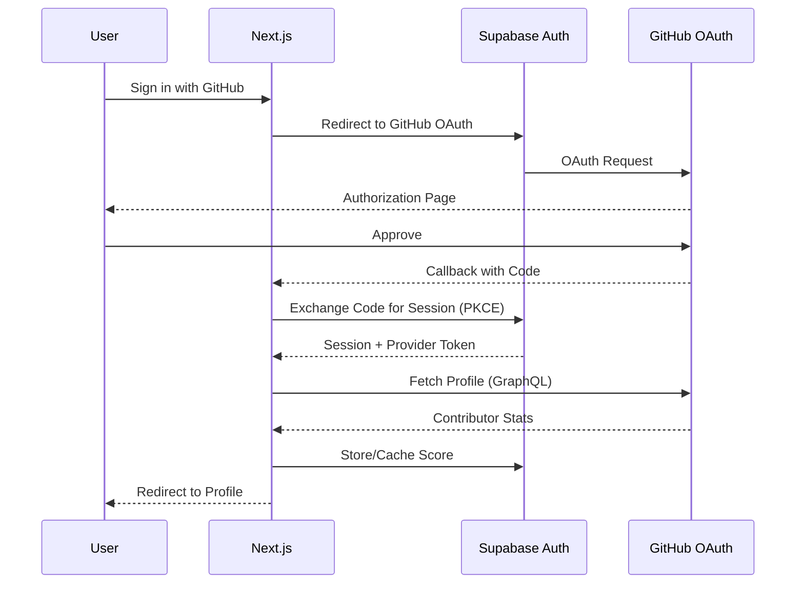

# System Flow Diagrams

This file maps the data flows and integration touchpoints within OSSfolio.

## Database Schema Indexing Flow

```mermaid
sequenceDiagram
  participant Client
  participant DB as Supabase PostgreSQL
  participant Cache as Edge Cache
  Client->>Cache: Request Leaderboard (page 1)
  Cache-->>Client: Returns cached results
  Note over DB: Under the hood, idx_profiles_score_username speeds up query scan times.
```

## API Request Flow

```mermaid
sequenceDiagram
  participant Client
  participant MW as Middleware
  participant API as API Route
  participant RL as Rate Limiter
  participant DB as Supabase
  participant GH as GitHub API

  Client->>MW: HTTP Request
  MW->>MW: Security Headers
  MW->>API: Forward Request
  API->>RL: Check Rate Limit
  RL-->>API: Allow / Deny
  alt Rate Limited
    API-->>Client: 429 Response
  else Allowed
    API->>DB: Query Data
    API->>GH: Fetch Live Stats
    DB-->>API: Cached Profile
    GH-->>API: Live Data
    API-->>Client: Merged Response
  end
```

## Auth Flow

```mermaid
sequenceDiagram
  participant User
  participant App as Next.js
  participant Supa as Supabase Auth
  participant GH as GitHub OAuth

  User->>App: Sign in with GitHub
  App->>Supa: Redirect to GitHub OAuth
  Supa->>GH: OAuth Request
  GH-->>User: Authorization Page
  User->>GH: Approve
  GH-->>App: Callback with Code
  App->>Supa: Exchange Code for Session (PKCE)
  Supa-->>App: Session + Provider Token
  App->>GH: Fetch Profile (GraphQL)
  GH-->>App: Contributor Stats
  App->>Supa: Store/Cache Score
  App-->>User: Redirect to Profile
```
